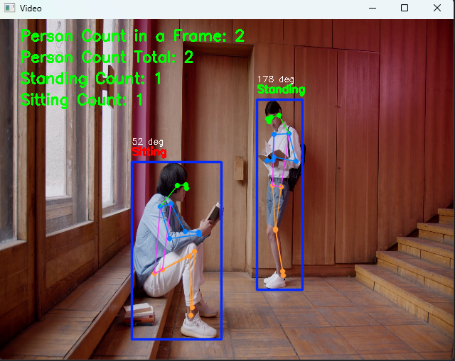
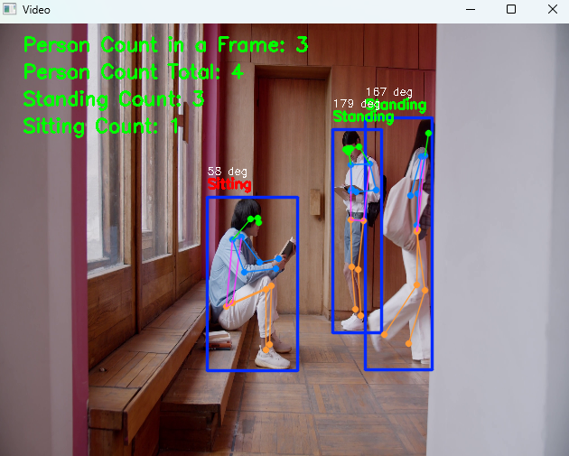

# 🧘 Pose State Tracker (Sit/Stand Analysis)


## 📖 Overview
**Pose State Tracker** is a computer vision application that analyzes human body posture in real-time. Utilizing the **YOLOv8 Pose** model, it detects key body landmarks (Shoulder, Hip, Knee) to calculate the body angle and classify the person's state as either **"Sitting"** or **"Standing"**.

The system tracks the duration of each posture and automatically exports the behavioral history to a JSON file.

## 🚀 Features
* **Real-Time Detection:** Works with Webcam or Video files.
* **Auto-Model Download:** Automatically downloads the required YOLOv8 weights (`yolov8n-pose.pt`) on first run.
* **State Classification:** Calculates angle between **Shoulder-Hip-Knee** to determine posture.
    * Angle > 145° → **Standing** (Green)
    * Angle < 145° → **Sitting** (Red)
* **Duration Tracking:** Logs how long a person remains in a specific state.
* **Data Export:** Saves session data to `behavior_history.json`.

## 📸 Screenshots & Demo

> **Note:** Below are examples of the application detecting different postures in real-time.

| Sitting Detection | Standing Detection |
|:---:|:---:|
|  |  |

## 🛠️ Installation

### 1. Clone the Repository
```bash
git clone https://github.com/atamertcan/Pose-State-Tracker.git
cd Pose-State-Tracker
```
2. Install Dependencies
Install the required Python libraries using pip.
```bash
pip install ultralytics, opencv-python, numpy
```
💻 Usage
Run the main script directly. By default, it will open your Webcam (0).
```bash
python main.py
```
⚙️ Configuration
You can modify the settings inside main.py to change the input source.
```bash
def main():
    # --- SETTINGS ---
    
    # Set to 0 for Webcam, or provide a file path like "videos/test.mp4"
    VIDEO_PATH = 0 
    
    # Model path (Auto-downloads if not found)
    MODEL_PATH = "yolov8n-pose.pt"
```
📊 Output Data (JSON)
When you quit the application (press q), the session history is saved to behavior_history.json.
Example Output:
```bash
[
    {
        "PersonID": 1,
        "Position": "Sitting",
        "Duration_sec": 12.5,
        "Start": "Sun Dec 28 14:00:00 2025",
        "End": "Sun Dec 28 14:00:12 2025"
    },
    {
        "PersonID": 1,
        "Position": "Standing",
        "Duration_sec": 5.2,
        "Start": "Sun Dec 28 14:00:12 2025",
        "End": "Sun Dec 28 14:00:17 2025"
    }
]
```
**🤖 How It Works**
The algorithm uses *Geometric Angle Calculation*:

*Keypoints Detected:* Left Shoulder (5), Left Hip (11), Left Knee (13).

*Angle Calculation:* The script calculates the angle at the hip connecting the shoulder and knee.

*Threshold:* If the angle is nearly straight (approx. 180°), the person is standing. If the angle is acute/bent (approx. 90°), the person is sitting.
